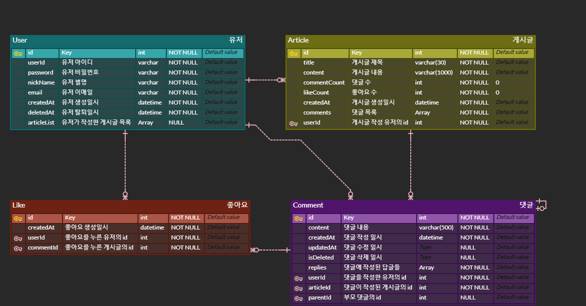

# 게시판 서비스 만들기

## 프로젝트 개요
- 개발 기간 : 2025.02.03 ~ 2024.02.14
> 연습만이 살 길!   게시판 CRUD 프로젝트에 댓글, 대댓글, 좋아요 등 기능을 함께 구현하며 java, Spring 기반의 웹 개발 프로젝트의 기초를 다시 다집니다.

## 🎉 주요기능
### 인덱스 페이지
- 가장 최근 작성된 게시글 6개를 조회합니다.
### 자유게시판
- 게시글을 작성, 조회, 수정, 삭제할 수 있습니다.
- 대시보드의 `페이지네이션`을 통해 게시판에 작성된 게시글 전체를 조회합니다.

### 게시글 좋아요 기능
- 게시글에 좋아요를 누르고, 취소할 수 있습니다.

### 댓글 및 대댓글 기능
- 게시글 `댓글` 작성, 조회, 수정, 삭제 기능을 사용할 수 있습니다.
- 게시글 댓글에 `대댓글`을 작성하고, 해당 내역을 조회, 수정, 삭제할 수 있습니다.
 

### Spring Security를 활용한 유저 인증 및 권한 설정
- `Spring Security`가 제공하는 csrf 토큰, 세션 기반의 인증 과정을 적용합니다.
- 로그인한 유저만이 게시글과 댓글을 작성할 수 있습니다.
- 게시글의 수정 및 삭제 권한은 작성자에게 있습니다.
- 대댓글을 포함한 댓글의 수정 및 삭제 권한은 작성자에게 있습니다.

## 📑 API 명세서

## ⛏ ERD

## 👀 디렉토리 구조

    
디렉토리 구조

    <pre>
        |-- java
        |   `-- com
        |       `-- example
        |           `-- board
        |               |-- article
        |               |   |-- controller
        |               |   |-- model
        |               |   |   |-- dto
        |               |   |   `-- entity
        |               |   |-- repository
        |               |   `-- service
        |               |-- comment
        |               |   |-- controller
        |               |   |-- model
        |               |   |   |-- dto
        |               |   |   `-- entity
        |               |   |-- repository
        |               |   `-- service
        |               |-- config
        |               |-- exception
        |               |-- index
        |               |-- like
        |               |   |-- controller
        |               |   |-- model
        |               |   |   |-- dto
        |               |   |   `-- entity
        |               |   |-- repository
        |               |   `-- service
        |               |-- user
        |               |   |-- controller
        |               |   |-- model
        |               |   |   |-- dto
        |               |   |   `-- entity
        |               |   |-- repository
        |               |   |   
        |               |   `-- service 
        |               |       
        |               `-- util
        `-- resources
        |-- static
        |   |-- css
        |   |   |-- article  
        |   |   |-- common
        |   |   `-- user 
        |   |-- js
        |   |   |-- article 
        |   |   `-- user
        |   |       
        |   |       
        |   `-- media
        |       |-- article 
        |       |-- comment 
        |       `-- user
        |          
        `-- templates
              |-- article 
              |-- common
              `-- user
    </pre>

## 🛠 사용 기술 스택
- 언어 및 빌드 도구
  - Java 17, Gradle
- 프레임워크
  - Spring Boot 3.4.2
- 데이터베이스, ORM
  - H2 Database, JPA (Hibernate) 
- 보안
  - Spring Security 3.4.2
- UI 구현
  - Thymeleaf, HTML/CSS, Javascript